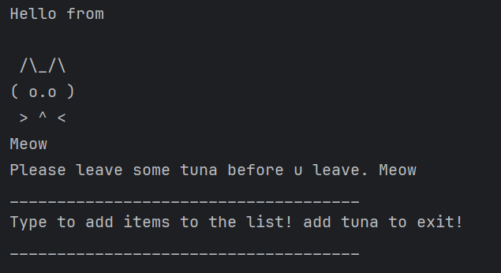
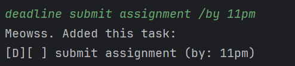
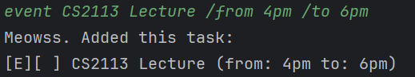
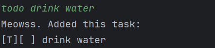
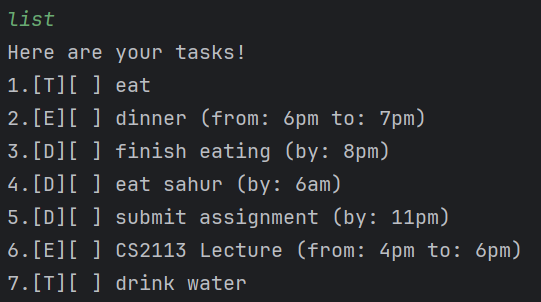
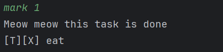
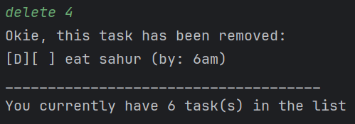
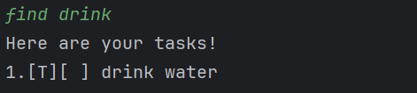
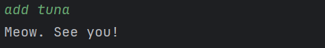

# Meow User Guide

Meow is a fun and intuitive task management system to help you keep track of your ToDos, Events and Deadlines!

# Adding Tasks
## Adding Deadlines: 
### `deadline {taskName} /by {deadline}`

Adds a task of the "Deadline" type. 

This task must contain: 
- taskName
- `deadline`: due date of this task

Example: `deadline submit assignment /by 11pm`

## Adding Events: 
### `event {taskName} /from {start time/day/date} / to {end time/day/date}`

Adds a task of the "Event" type.

This task must contain:
- taskName
- `start time/day/date`: the starting time of this event
- `end time/day/date`: the ending time of this event

Example: `event CS2113 Lecture /from 4pm /to 6pm`

## Adding ToDos:
### `todo {taskName}`

Adds a task of the "ToDo" type.

This task must contain:
- taskName

Example: `todo drink water`

## Listing Tasks
### `list`

Lists all existing tasks.

## Marking and Unmarking Tasks
### `mark {taskNumber}` or `unmark {taskNumber}`

This marks a specified task as done or not done. 

The `taskNumber` of the task to be marked or unmarked can be seen by using the command `list`. 

Example: `mark 1`

## Deleting Tasks
### `delete {taskNumber}`

This deletes a specified task from the list of existing tasks. 

The `taskNumber` of the task to be deleted can be seen by using the command `list`.

Example: `delete 4`

## Finding Tasks
### `find {keyword}`

This searches the list of existing tasks for tasks that match the specified keyword. 

A list of matching tasks is then printed.

Example: `find drink`

## Exiting Program
### `add tuna`

Closes the program. 

